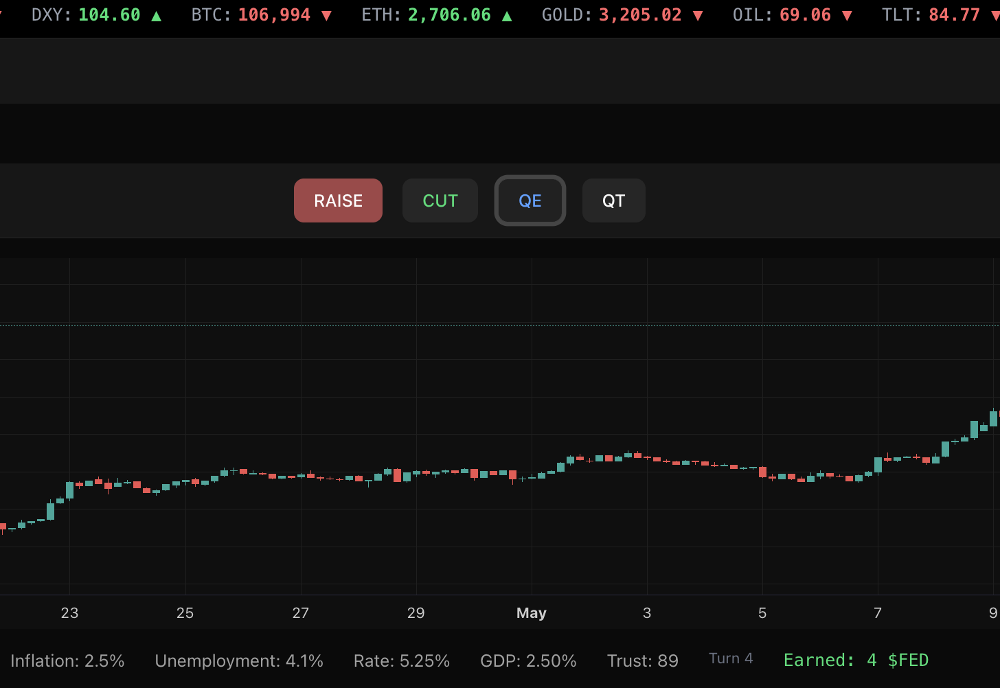

# Fed Simulator

Fed Simulator is a macroeconomic simulation game where you play as the Federal Reserve. Your goal is to manage interest rates, deploy monetary policy tools (QE, QT), and maintain economic stability while reacting to live market conditions. Successful players are rewarded with the $FED token on Solana.



## Features

- Simulates key macroeconomic indicators: inflation, unemployment, GDP growth, interest rates, and trust
- Allows user decisions: raise/cut interest rates, quantitative easing (QE), and quantitative tightening (QT)
- Displays real-time chart and ticker reactions
- Integrates Solana wallet login and token claiming
- Rewards users with $FED tokens based on gameplay performance


## Tech Stack

- Next.js (App Router)
- React with Tailwind CSS
- lightweight-charts for dynamic charting
- Solana: `@solana/web3.js`, SPL Token, Wallet Adapter
- Hosted on Vercel or custom deployment


## Solana Integration

- Uses the existing $FED token  
  Mint: `5s4gk4Y4PC9FdRz1y54hs4Qod5J8mSbHoW2FmrVapump`
- Token claim flow built with `getOrCreateAssociatedTokenAccount` and `transfer`
- Tokens are transferred from a treasury wallet to users who connect and complete the game


## Ultimate goal: Make a tool so realistic that even Jerome Powell would use it. 

Other potential use-cases:

- Open-source policy lab for macro students

- Training platform for central banking courses

- Interactive visualization layer for real-world economic data

- Realistic decision simulator with AI “FOMC members” trained on real speeches
  

## Contributing

Contributions are welcome. Please fork the repo, submit PRs, or suggest improvements related to game logic, Solana integration, or UI/UX.


## Getting Started

1. Install dependencies:
   ```bash
   npm install
   # or
   yarn
   # or
   pnpm install
   # or
   bun install
   ```

2. Run the development server:
   ```bash
   npm run dev
   # or
   yarn dev
   # or
   pnpm dev
   # or
   bun dev
   ```

3. Open [http://localhost:3000](http://localhost:3000) in your browser.


Developed for the Solana Hackathon.

